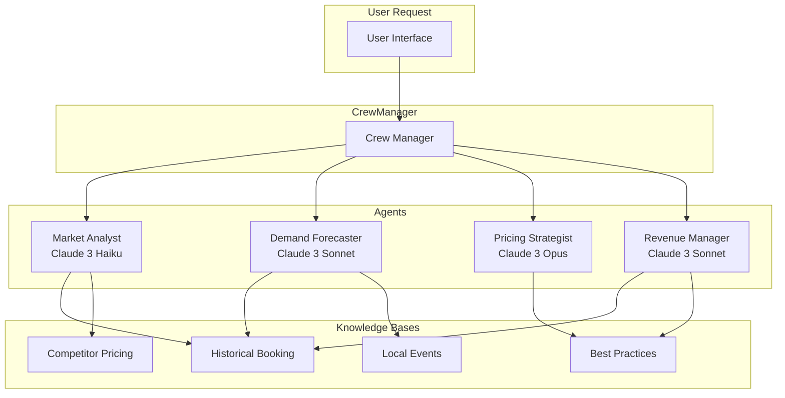

# AWS AI 酒店收益优化系统架构分析

> 本文档分析 AWS 开源项目 [aws-samples/sample-ai-hotel-revenue-management-system](https://github.com/aws-samples/sample-ai-hotel-revenue-management-system)，总结其核心架构，为 V52 AI 能力升级提供参考。

---

## 📋 项目概述

AWS 官方开源的 AI 酒店收益优化系统是一个**生产级别的多Agent AI系统**，使用 CrewAI 和 Amazon Bedrock AgentCore 构建。

### 核心数据

| 指标 | 值 |
|------|-----|
| Stars | 5 |
| Forks | 1 |
| 语言 | Python (66.8%), HTML (22.1%), Shell (10%) |
| 许可证 | MIT-0 |
| 部署方式 | Docker + AWS Bedrock AgentCore |

### 业务价值

- **RevPAR提升**：5-15% 每可用客房收入增长
- **效率提升**：减少80%人工定价分析时间
- **预测准确率**：入住率和收入预测提升30-40%
- **响应速度**：实时响应市场变化和竞品动作

---

## 🏗️ 核心架构

### 1. 多Agent协作架构 (CrewAI)

系统由4个专业Agent组成Crew（团队），每个Agent使用不同能力的Claude模型：



### Agent职责详解

| Agent | 模型 | 职责 | 知识库 |
|--------|------|------|--------|
| **Market Analyst** | Claude 3 Haiku | 监控市场趋势、竞品价格、识别需求模式 | 竞品价格、行业基准 |
| **Demand Forecaster** | Claude 3 Sonnet | 预测需求、预订节奏、入住率 | 历史预订、活动日历 |
| **Pricing Strategist** | Claude 3 Opus | 制定定价策略、渠道价格、交叉销售 | 最佳实践、定价规则 |
| **Revenue Manager** | Claude 3 Sonnet | 执行监控、KPIs评估、报告生成 | 历史预订、最佳实践 |

---

### 2. 分层模型架构

AWS采用按任务复杂度分配不同能力模型：

```yaml
Provider: AMAZON (默认)
  Tier 1: Nova Premier - 复杂推理（定价策略）
  Tier 2: Nova Pro - 中等复杂度（市场分析、需求预测）
  Tier 3: Nova Lite - 简单任务（数据处理）
  Tier 4: Nova Micro - 基础任务（格式化）

Provider: ANTHROPIC
  Tier 1: Claude 3.7 Sonnet - 复杂推理
  Tier 2: Claude 3.7 Sonnet - 中等复杂度
  Tier 3: Claude 3.5 Haiku - 简单任务
  Tier 4: Claude 3 Haiku - 基础任务

Provider: HYBRID (推荐生产使用)
  Tier 1: Claude 3.7 Sonnet - 定价策略
  Tier 2: Nova Pro - 市场分析、需求预测
  Tier 3: Nova Lite - 简单任务
  Tier 4: Nova Micro - 基础任务
```

**性能对比**：

| Provider | 执行时间 | 质量 | 成本 | 推荐场景 |
|----------|----------|------|------|----------|
| HYBRID | 46.2秒 | ⭐⭐⭐⭐⭐ | ⭐⭐⭐⭐ | 平衡性能（推荐） |
| ANTHROPIC | 50.8秒 | ⭐⭐⭐⭐⭐ | ⭐⭐⭐ | 最高质量 |
| AMAZON | 51.8秒 | ⭐⭐⭐⭐ | ⭐⭐⭐⭐⭐ | 成本最优 |

---

### 3. 知识库架构

```
Knowledge Base/
├── historical_booking_data.txt     # 历史预订数据
│   ├── 月度/年度入住率
│   ├── 各房型ADR（淡平旺季节）
│   ├── 预订渠道分布
│   ├── 取消率模式
│   └── 客人细分
├── competitor_pricing.txt          # 竞品价格
│   ├── 豪华酒店价格区间
│   ├── 高端酒店价格区间
│   ├── OTA表现（价格一致率）
│   └── 竞品促销信息
├── local_events.txt               # 本地活动
│   ├── 会议/展览
│   ├── 文化活动
│   ├── 体育赛事
│   └── 季节性因素
└── revenue_management_best_practices.txt  # 行业最佳实践
    ├── KPI基准
    ├── 定价策略模板
    └── 渠道优化指南
```

### 4. 工具调用架构

```python
# Market Analyst Tools
def get_competitor_pricing(location: str, dates: list) -> dict:
    """获取竞品价格"""

def get_market_trends(hotel_id: str) -> dict:
    """获取市场趋势"""

# Demand Forecaster Tools
def get_historical_booking_data(hotel_id: str, date_range: tuple) -> dict:
    """获取历史预订数据"""

def get_local_events(location: str, date_range: tuple) -> list:
    """获取本地活动"""

# Pricing Strategist Tools
def calculate_optimal_price(
    demand_level: str,
    competitor_prices: dict,
    inventory: int
) -> dict:
    """计算最优价格"""

def apply_pricing_rules(
    season: str,
    events: list,
    inventory: int
) -> dict:
    """应用定价规则"""

# Revenue Manager Tools
def generate_revenue_report(
    market_analysis: dict,
    demand_forecast: dict,
    pricing_strategy: dict
) -> dict:
    """生成收益报告"""
```

---

### 5. 输入处理

系统支持多种输入格式：

```json
// 格式1: 自然语言
{
  "prompt": "帮我分析一下北京王府井酒店的收益优化，当前ADR 800，入住率70%"
}

// 格式2: 结构化JSON
{
  "hotel_name": "北京王府井酒店",
  "hotel_location": "北京",
  "current_adr": "800",
  "historical_occupancy": "70%",
  "target_revpar": "15% increase"
}

// 格式3: 混合模式
{
  "message": "我想优化 Miami 酒店收益，120间客房，当前ADR $280",
  "hotel_rating": "4.5"
}
```

**智能错误处理**：

```json
// 无效查询
{
  "error": "irrelevant_query",
  "message": "我专注于酒店收益优化，请问有什么可以帮您？"
}

// 预订请求
{
  "error": "booking_request",
  "message": "我不处理预订，专注于酒店收益管理。"
}

// 信息不足
{
  "error": "insufficient_information",
  "required_info": ["酒店名称", "位置", "当前性能指标"]
}
```

---

### 6. 输出格式

```markdown
## 市场分析

### 竞争定位
- **市场定位**: 中高端商务酒店
- **目标客群**: 商务出行70%，休闲旅游30%
- **竞争优势**: 位置优越、设施新、服务好

### 竞品分析
- **主要竞品**: Grand Hyatt ($289-349), Marriott ($269-329)
- **价格差距**: 当前ADR略高于竞品5%
- **建议**: 保持溢价策略，强化差异化服务

## 需求预测

### 入住率预测
| 日期 | 预测入住率 | 趋势 |
|------|-----------|------|
| 周一 | 72% | ↓5% |
| 周二 | 75% | → |
| 周三 | 78% | ↑3% |
| 周四 | 82% | ↑4% |
| 周五 | 88% | ↑6% |
| 周六 | 91% | 峰值 |
| 周日 | 85% | ↓6% |

### 高需求期
- **高峰**: 周末（周六入住率预计91%）
- **低谷**: 周一-周二（商务客减少）

## 定价策略

### 建议价格区间
| 房型 | 平日 | 周末 | 节假日 |
|------|------|------|--------|
| Standard | $280-300 | $320-350 | $380-420 |
| Deluxe | $340-370 | $390-430 | $450-500 |
| Suite | $480-550 | $550-650 | $700-800 |

### 动态调整规则
- **库存紧张** (<20%): +30%
- **临期促销** (1天内): -15%
- **周末**: +20%
- **节假日**: +40%
- **竞品降价**: 跟进调整

## 收益计划

### 预计RevPAR
- **当前**: $176
- **目标**: $195 (+10.8%)
- **策略**: 周末溢价 + 周中促销

### 执行建议
1. 周中（周一-周四）推出"连住优惠"提升入住率
2. 周末维持高价策略，最大化ADR
3. 关注竞品价格变化，及时调整
```

---

## 🔌 生产集成架构

### AWS部署架构

```
┌─────────────────────────────────────────────────────────────┐
│                    AWS Cloud                                 │
│  ┌─────────────────────────────────────────────────────┐   │
│  │           Bedrock AgentCore Runtime                 │   │
│  │  ┌─────────┐ ┌─────────┐ ┌─────────┐ ┌─────────┐   │   │
│  │  │  Market │ │ Demand  │ │ Pricing │ │ Revenue │   │   │
│  │  │ Analyst │ │Forecaster│ │Strategist│ │ Manager │   │   │
│  │  └────┬────┘ └────┬────┘ └────┬────┘ └────┬────┘   │   │
│  │       └───────────┴───────────┴───────────┘        │   │
│  └──────────────────────┬──────────────────────────────┘   │
│                         │                                   │
│  ┌──────────────────────▼──────────────────────────────┐   │
│  │              Amazon Bedrock Models                   │   │
│  │   Claude 3.7 Sonnet │ Claude 3 Haiku │ Nova       │   │
│  └──────────────────────────────────────────────────────┘   │
│                                                              │
│  ┌─────────────┐  ┌─────────────┐  ┌─────────────┐        │
│  │  CloudWatch  │  │     ECR     │  │   VPC       │        │
│  │    Logs     │  │   Registry  │  │  Network    │        │
│  └─────────────┘  └─────────────┘  └─────────────┘        │
└─────────────────────────────────────────────────────────────┘
```

### 数据集成路线图

AWS项目推荐的生产数据集成方案：

| 数据类型 | 数据源 | AWS服务 |
|----------|--------|---------|
| **竞品价格** | RateGain, OTA Insight, Travelclick | Lambda + DynamoDB |
| **历史预订** | Opera, Protel, RMS (PMS) | Kinesis + Timestream |
| **本地活动** | Eventbrite, 本地Tourism API | EventBridge + SageMaker |
| **行业基准** | STR, Tourism Economics | S3 + Personalize |

---

## ⚠️ 重要发现

### 当前所有数据都是模拟数据

AWS项目**目前使用的是静态模拟数据**，非真实业务数据：

- **历史预订数据**：假设的"Grand Pacific Resort"酒店
- **竞品价格**：假设的Grand Hyatt, Marriott等
- **本地活动**：假设的Miami, FL活动

### 生产集成需自建

如需投入生产，需要对接：

1. **真实PMS系统** - Opera, Protel, RMS等
2. **竞品价格API** - RateGain, OTA Insight等
3. **活动信息API** - Eventbrite等
4. **行业基准API** - STR报告等

---

## 📊 V52 vs AWS 能力对比

| 维度 | V52 | AWS | 差距分析 |
|------|-----|-----|----------|
| **AI架构** | 单一大模型对话 | 多Agent协作 | ⚠️ 重大差距 |
| **Agent能力** | 简单意图识别 | 4个专业Agent分工 | ⚠️ 重大差距 |
| **知识库** | 无 | 4类知识库+RAG | ⚠️ 重大差距 |
| **输入方式** | 结构化API | 自然语言+结构化JSON | ✅ V52可接受 |
| **输出格式** | 单一回复 | 完整收益报告 | ⚠️ 需改进 |
| **模型选择** | 固定模型 | 分层自动选择 | ⚠️ 需改进 |
| **工具调用** | 基础FC | 专业工具集 | ⚠️ 需改进 |
| **可观测性** | 基础日志 | CloudWatch完整监控 | ⚠️ 需改进 |

---

## 🛠️ V52改进建议

### P0 - 核心改进（高价值高优先级）

#### 1. 多Agent架构重构

**目标**：将AI服务拆分为专业Agent

```typescript
// V52 AI Gateway
class AIGateway {
  async handleRequest(request: UserRequest): Promise<AIResponse> {
    // 1. 意图分类
    const intent = await this.classifyIntent(request);

    // 2. 路由到专业Agent
    switch (intent.category) {
      case 'pricing':
        return await this.pricingAgent.analyze(request);
      case 'customer_service':
        return await this.customerServiceAgent.reply(request);
      case 'content':
        return await this.contentAgent.generate(request);
      default:
        return await this.generalAgent.respond(request);
    }
  }
}

// Pricing Agent
class PricingAgent {
  private knowledgeBase: PricingKnowledgeBase;

  async analyze(request: PricingRequest): Promise<PricingReport> {
    // 查询知识库
    const historical = await this.knowledgeBase.getHistoricalData(request.hotelId);
    const competitors = await this.knowledgeBase.getCompetitorPrices(request.location);
    const events = await this.knowledgeBase.getLocalEvents(request.location, request.dates);

    // 生成报告
    return {
      marketAnalysis: this.analyzeMarket(historical, competitors),
      demandForecast: this.forecastDemand(events, historical),
      pricingStrategy: this.calculatePricing(historical, competitors, events),
    };
  }
}
```

**影响**：大幅提升AI拟人化程度和业务理解能力

#### 2. 知识库建设

**目标**：建立四大知识库

```typescript
// 知识库类型定义
interface PricingKnowledgeBase {
  // 历史预订数据
  getHistoricalData(hotelId: string, dateRange: DateRange): Promise<HistoricalBooking>;

  // 竞品价格
  getCompetitorPrices(location: string, dates: DateRange): Promise<CompetitorPricing[]>;

  // 本地活动
  getLocalEvents(location: string, dateRange: DateRange): Promise<LocalEvent[]>;

  // 行业基准
  getIndustryBenchmarks(segment: string): Promise<IndustryBenchmark>;
}
```

**数据来源规划**：

| 知识库 | 数据来源 | 优先级 | 难度 |
|--------|----------|--------|------|
| 历史预订 | PMS系统API | P0 | 高 |
| 竞品价格 | 手动维护/爬虫 | P1 | 中 |
| 活动日历 | 第三方API | P1 | 中 |
| 行业基准 | STR报告 | P2 | 低 |

---

### P1 - 重要改进（中等价值）

#### 3. 分层模型路由

**目标**：按任务复杂度自动选模型

```typescript
interface LLMProvider {
  complete(
    prompt: string,
    tier: 'simple' | 'medium' | 'complex'
  ): Promise<string>;
}

class HybridLLMProvider implements LLMProvider {
  async complete(prompt: string, tier: string): Promise<string> {
    switch (tier) {
      case 'simple':
        // 简单任务 → 本地规则/小模型（0成本）
        return this.localRuleEngine.process(prompt);

      case 'medium':
        // 中等复杂度 → DeepSeek（低成本）
        return await this.deepseek.complete(prompt);

      case 'complex':
        // 复杂推理 → Claude/GPT-4（高成本）
        return await this.anthropic.complete(prompt);
    }
  }
}

// 使用示例
const greetingTier = classifyTask('天气怎么样'); // 'simple'
const analysisTier = classifyTask('分析一下本月收益'); // 'complex'
```

#### 4. Provider抽象层

**目标**：支持模型Provider快速切换

```typescript
interface LLMProvider {
  name: string;
  complete(messages: Message[]): Promise<string>;
  getCost(): number;
}

// 多Provider实现
const providers = {
  deepseek: new DeepSeekProvider(),
  openai: new OpenAIProvider(),
  anthropic: new AnthropicProvider(),
  local: new LocalRuleProvider(),
};

// 配置切换
type ModelProvider = 'deepseek' | 'openai' | 'anthropic' | 'local';

// 环境变量控制
const activeProvider = process.env.MODEL_PROVIDER || 'deepseek';
```

---

### P2 - 优化改进（低优先级）

#### 5. 结构化输出报告

```typescript
// 输出类型区分
type OutputType = 'report' | 'conversation' | 'data';

interface OutputFormatter {
  format(type: OutputType, data: any): string;
}

const formatters = {
  report: new MarkdownReportFormatter(),   // 收益报告 → Markdown
  conversation: new ChatFormatter(),        // 客服对话 → 自然语言
  data: new JSONFormatter(),                // 数据查询 → JSON
};
```

#### 6. 生产级监控

```typescript
interface AIMetrics {
  // 业务指标
  conversionRate: number;
  handoverRate: number;
  avgResponseTime: number;

  // 模型指标
  tokenUsage: number;
  apiCost: number;
  errorRate: number;

  // 质量指标
  userSatisfaction: number;
  humanOverrideRate: number;
}

// 监控指标收集
class AIMetricsCollector {
  record(metric: keyof AIMetrics, value: number): void;
  getReport(): AIMetrics;
  alertIfAbnormal(metric: keyof AIMetrics): void;
}
```

---

## 📈 实施路线图

### Phase 1: 架构铺垫（2周）

- [ ] 设计多Agent架构方案
- [ ] 定义Agent接口和消息格式
- [ ] 搭建Agent基础框架

### Phase 2: 知识库建设（4周）

- [ ] 接入PMS历史数据
- [ ] 建立竞品价格知识库
- [ ] 接入活动日历API
- [ ] 实现RAG检索

### Phase 3: Agent开发（4周）

- [ ] 开发Pricing Agent
- [ ] 开发CustomerService Agent
- [ ] 开发Content Agent
- [ ] 集成测试

### Phase 4: 生产优化（2周）

- [ ] 分层模型路由
- [ ] Provider抽象层
- [ ] 监控告警
- [ ] 性能优化

---

## 📚 参考资料

1. [AWS AI Hotel Revenue Management System](https://github.com/aws-samples/sample-ai-hotel-revenue-management-system)
2. [CrewAI Framework](https://github.com/joaomdmoura/crewAI)
3. [Amazon Bedrock AgentCore](https://docs.aws.amazon.com/bedrock/)
4. [RAG Architecture Guide](https://aws.amazon.com/blogs/machine-learning/)

---

## 🔗 相关文档

- [AI-LLM-集成方案](./AI-LLM-Integration-Plan.md) - 现有AI架构文档
- [AI客服服务](../src/services/aiAgentService.ts) - 现有客服实现
- [AI服务类型定义](../src/services/ai/types.ts) - 类型定义

---

> 💡 **最后更新**: 2026-03-28
> 💡 **分析目的**: 为V52 AI能力升级提供架构参考
